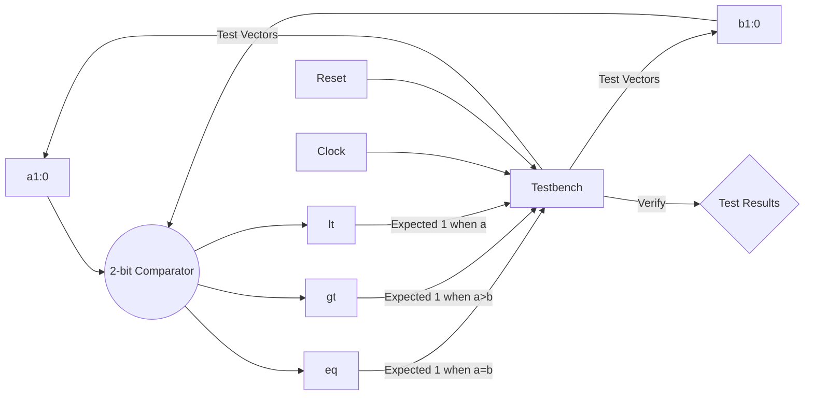

# 2-bit Comparator

**Category**: Combinational  
**Complexity**: simple

## Original Prompt

```
Design a 2-bit comparator with inputs a[1:0], b[1:0] and outputs eq, gt, lt. Include testbench.
```

## Generated Mermaid Diagram


