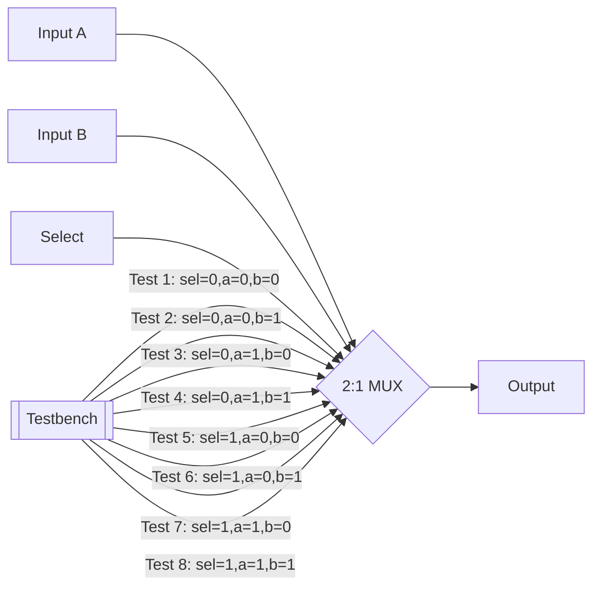

# 2-to-1 MUX

**Category**: Combinational  
**Complexity**: simple

## Original Prompt

```
Design a 2-to-1 multiplexer with inputs a, b, select sel, and output out. Include testbench testing all combinations.
```

## Generated Mermaid Diagram


