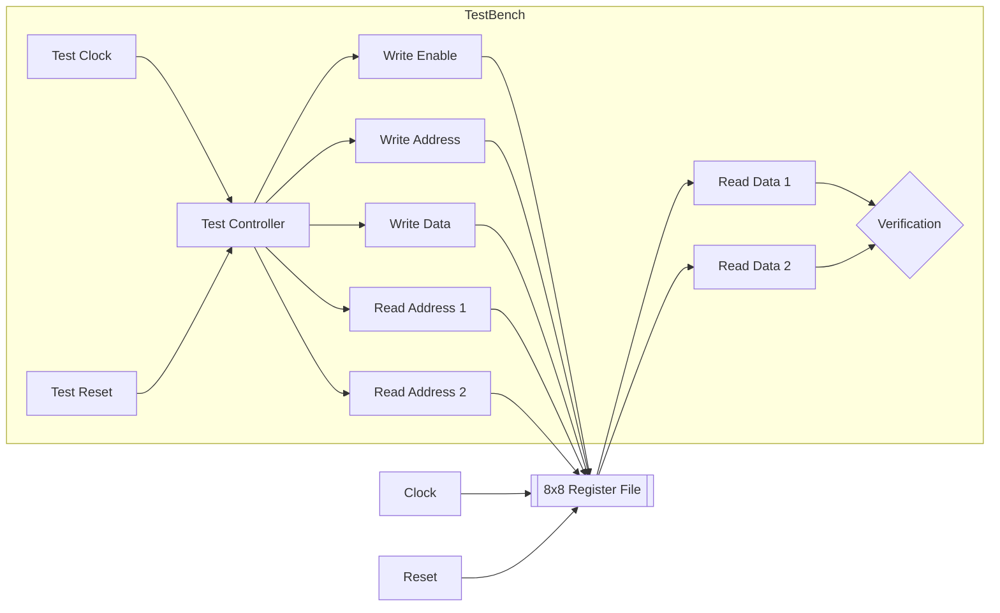

# 8-bit Register File

**Category**: CPU Component  
**Complexity**: complex

## Original Prompt

```
Create 8-register × 8-bit register file with dual read ports and single write port. Include testbench with simultaneous operations.
```

## Generated Mermaid Diagram


