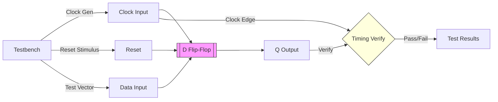

# D Flip-Flop

**Category**: Sequential  
**Complexity**: simple

## Original Prompt

```
Create a D flip-flop with clock, reset, input d, and output q. Include testbench with timing verification.
```

## Generated Mermaid Diagram


