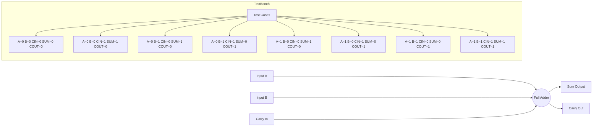

# Full Adder

**Category**: Combinational  
**Complexity**: simple

## Original Prompt

```
Create a full adder with inputs a, b, cin and outputs sum, cout. Include testbench with all 8 cases.
```

## Generated Mermaid Diagram


