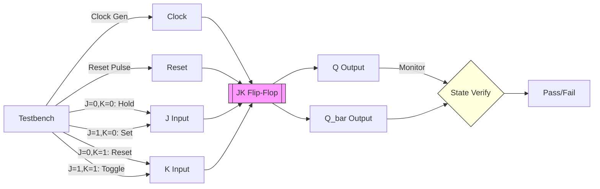

# JK Flip-Flop

**Category**: Sequential  
**Complexity**: simple

## Original Prompt

```
Create a JK flip-flop with clock, reset, inputs j and k, and outputs q and q_bar. Include testbench verifying all four input combinations (00, 01, 10, 11).
```

## Generated Mermaid Diagram


