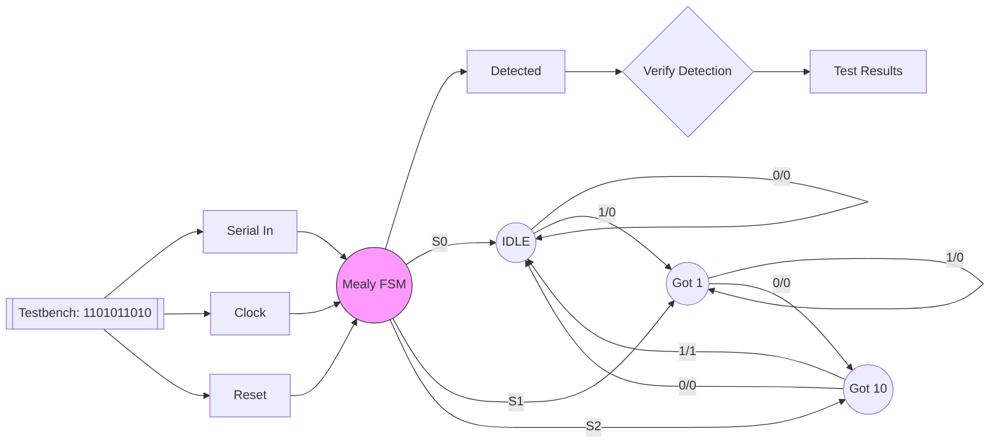

# Mealy Sequence Detector (101)

**Category**: State Machine  
**Complexity**: medium

## Original Prompt

```
Design a Mealy FSM detecting sequence 101 in serial input with non-overlapping detection. Output high for one cycle when pattern detected. Include testbench with sequence: 1101011010.
```

## Generated Mermaid Diagram


