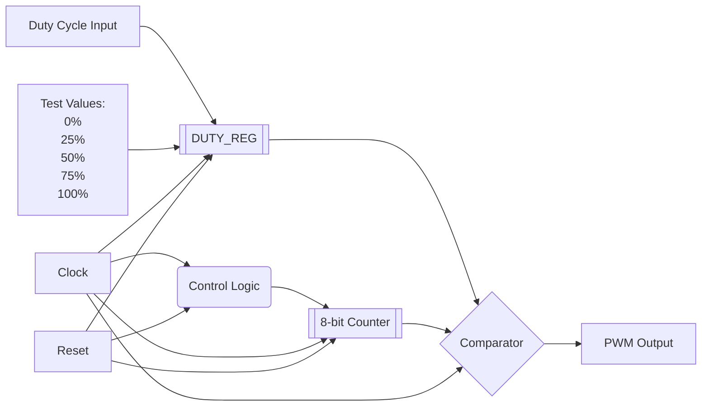

# PWM Generator

**Category**: Advanced Sequential  
**Complexity**: complex

## Original Prompt

```
Design 8-bit resolution PWM generator with configurable duty cycle. Include testbench with duty cycles: 0%, 25%, 50%, 75%, 100%.
```

## Generated Mermaid Diagram


