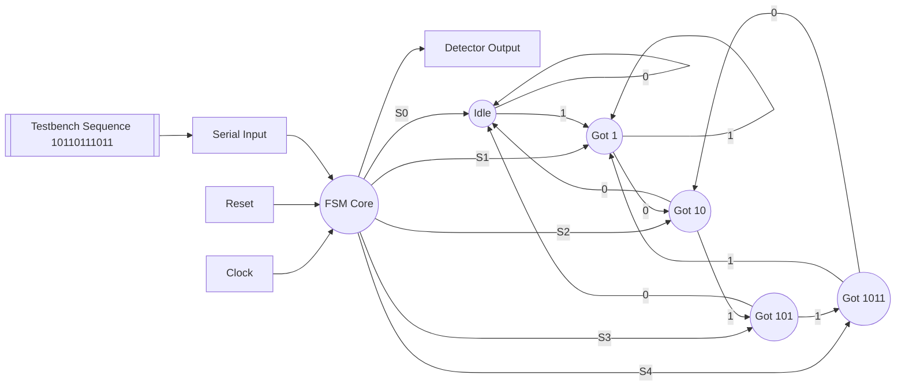

# Sequence Detector

**Category**: State Machine  
**Complexity**: medium

## Original Prompt

```
Design an FSM detecting pattern 1011 in serial input with overlapping detection. Include testbench with sequence: 10110111011.
```

## Generated Mermaid Diagram


