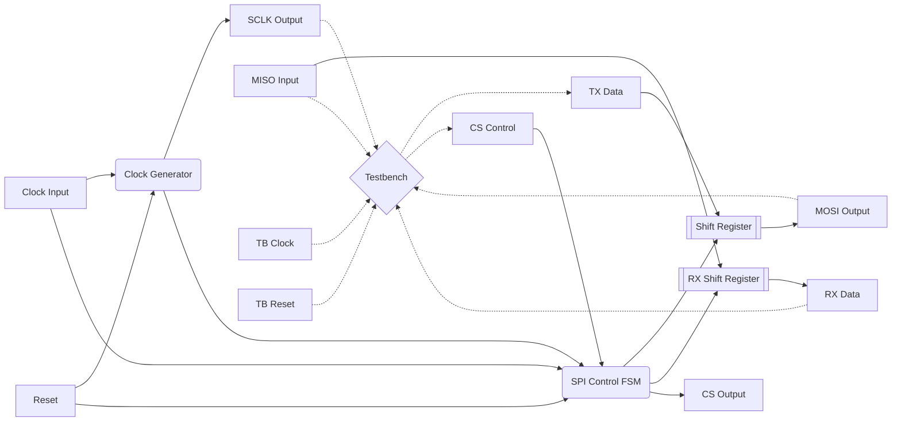

# SPI Master

**Category**: Protocol  
**Complexity**: complex

## Original Prompt

```
Design SPI master supporting mode 0 (CPOL=0, CPHA=0). Include SCLK generation, MOSI/MISO handling. Include testbench.
```

## Generated Mermaid Diagram


