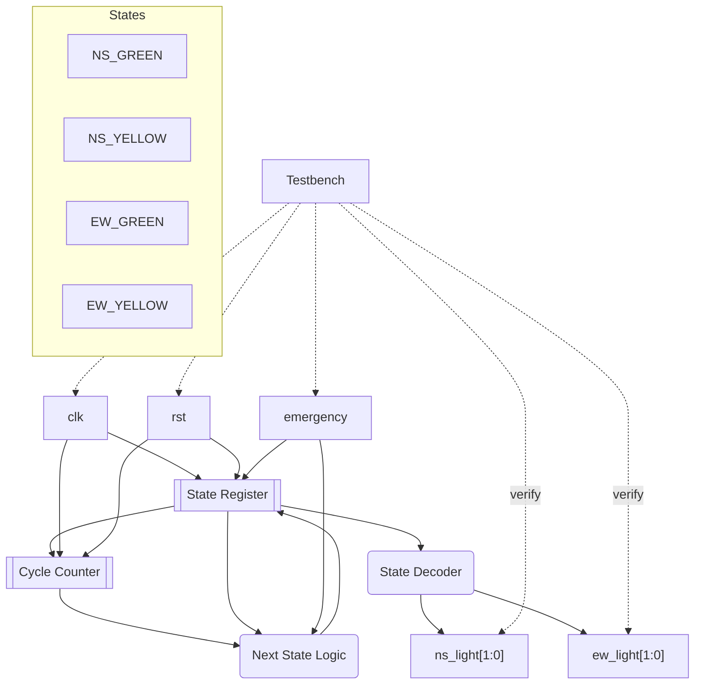

# Traffic Light Controller

**Category**: State Machine  
**Complexity**: complex

## Original Prompt

```
Design a traffic light FSM with 4 states: NS_GREEN, NS_YELLOW, EW_GREEN, EW_YELLOW. Inputs: clk, rst, emergency. Outputs: ns_light[1:0], ew_light[1:0]. Timing: GREEN=8 cycles, YELLOW=2 cycles. Emergency makes both RED. Include testbench.
```

## Generated Mermaid Diagram


