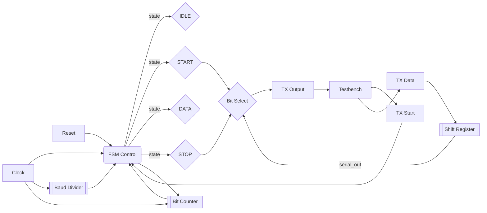

# UART Transmitter

**Category**: State Machine  
**Complexity**: complex

## Original Prompt

```
Design UART transmitter with states: IDLE, START, DATA, STOP. Protocol: START(0), 8 data bits LSB-first, STOP(1). Baud rate divider. Include testbench.
```

## Generated Mermaid Diagram


